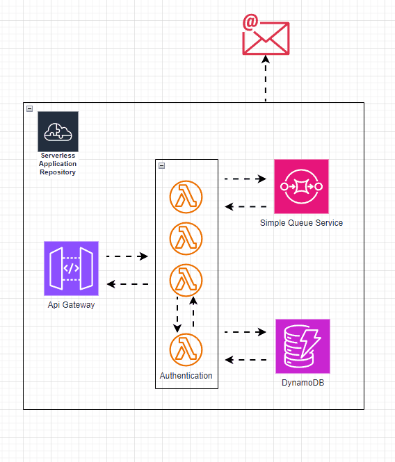

# Shortener URL Serverless

Build & Deploy
```
make deploy
```

# Shortener URL Service

## Overview
This service provides a URL shortening feature, built using Golang and the Serverless framework on AWS. It leverages AWS Lambda, DynamoDB, API Gateway, and SQS to offer a robust and scalable solution.

## Features
- **Authentication and Authorization**: Secure access control using JWT tokens.
- **Member Management**: Allows for user registration, updates, and deletion.
- **URL Shortening**: Members can create shortened URLs.
- **Rate Limiting**: Free tier allows up to 10 URL shortenings per month.

## Technologies
- **Golang**: The primary programming language used.
- **AWS Lambda**: Serverless compute service that runs the code.
- **DynamoDB**: NoSQL database service for storing user and URL data.
- **API Gateway**: Manages and secures access to the APIs.
- **SQS**: Message queuing service used for decoupling and scaling applications.

## Architecture
1. **API Gateway** handles incoming requests and routes them to the appropriate Lambda functions.
2. **Lambda Functions** execute the logic for user management, authentication, authorization, and URL shortening.
3. **DynamoDB** stores all the data related to users and shortened URLs.
4. **SQS** is used for handling asynchronous tasks that can be processed independently of the main application flow.

## Usage
To use the URL shortening service, users must first register and authenticate. Upon authentication, they can create shortened URLs. Each member is allowed to create up to 10 shortened URLs per month for free.

## Deployment
The service is deployed using the Serverless framework, which automates the deployment of the necessary AWS resources and the application code.

## Security
The service implements JWT-based authentication and role-based authorization to ensure that only authorized users can create and manage URLs.

## Build
```
make build
```

## Deploy
```
make deploy
```
# OR use serverless cli
```
serverless deploy --stage <name_stage> "dev, stagging, prod" --verbose
```

# Link Service
this link service deployment
```
https://oyaso15cne.execute-api.ap-southeast-1.amazonaws.com/prod
```

## Architecture
